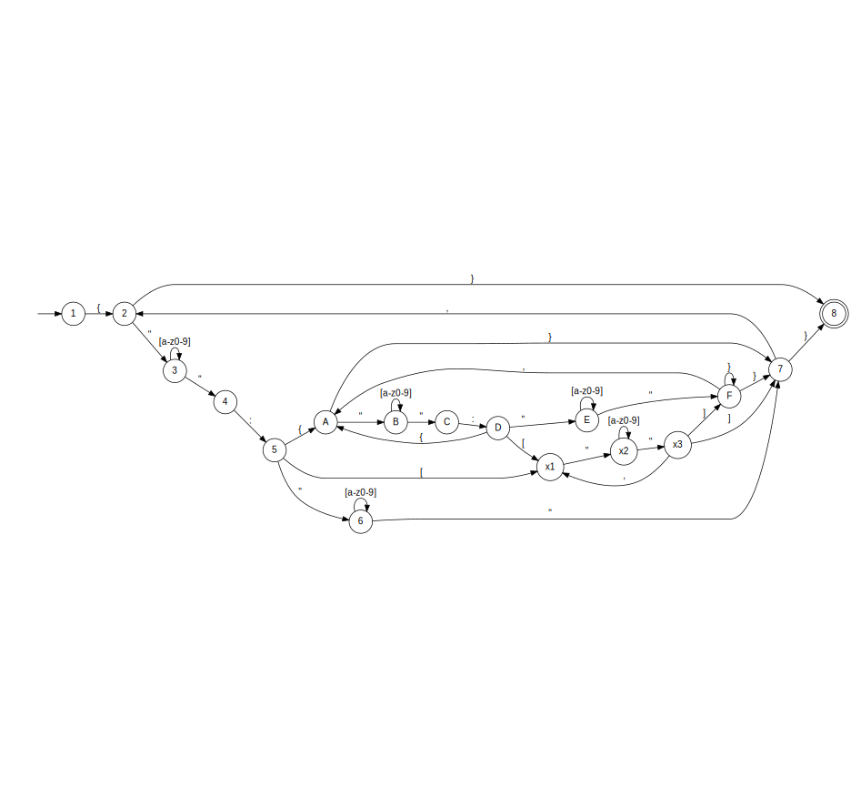

# JSON-FSM SERVICE

This project was developed for the subject of Discrete Mathematics at the Universidad Atlántida Argentina.

### Model used by this non-deterministic finite automaton (NFA)



* Note: This does not cover the full JSON specification.

## How to run the project

### Requirements
- OpenJDK 8

### From the terminal

```shell
$ ./mvnw clean install spring-boot:run
```
